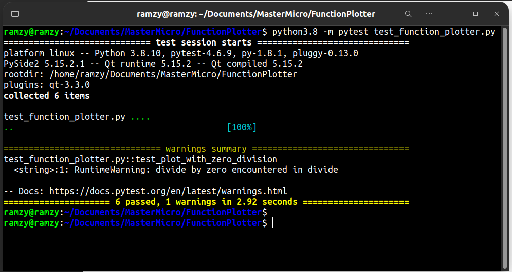

# Function Plotter

## Description
Function Plotter is a simple Python application that allows users to plot mathematical functions and customize the appearance of the generated plot. The application is built using PySide2 (Qt for Python) for the GUI and matplotlib for plotting.

## Features

- Enter a mathematical function and its range to generate a plot.
- The following operators are supported: + - / * ^. 
- Customize the plot appearance by enabling/disabling the grid and axes.
- Save the generated plot as an image (PNG or JPEG).
- Error handling for invalid input with a message box.

## Prerequisites

Before running the Function Plotter application, make sure you have the following installed:

- Python 3
- PySide2 library
- NumPy library
- Matplotlib library

You can install the required libraries using `pip`:

```bash
pip install PySide2 numpy matplotlib pytest pytest-qt
``` 

# Examples
- Example for plotting (x^2 + 2x + 1) from -10 to 10

- Example for Syntax Error for invalid input function

- Example for ZeroDivisionError

- Example for ValueError for invalid input range 
1. lower limit is larger than upper limit

2. input range is not numeric


## Testing
Automated tests are implemented using pytest and pytest-qt. To run the tests, navigate to the project directory and run the following command:

```bash
python3.8 -m pytest test_function_plotter.py
```

- Test cases for the function plotter
for test cases details, please check the "test_function_plotter.py" file
- test cases implemented using pytest and pytest-qt and are:
1. testing plot
2. testing plot with invalid function
3. testing plot with invalid range (range is not numeric)
4. testing plot with invalid range (lower limit is larger than upper limit)
5. testing plot with zero division error
6. testing reset button




